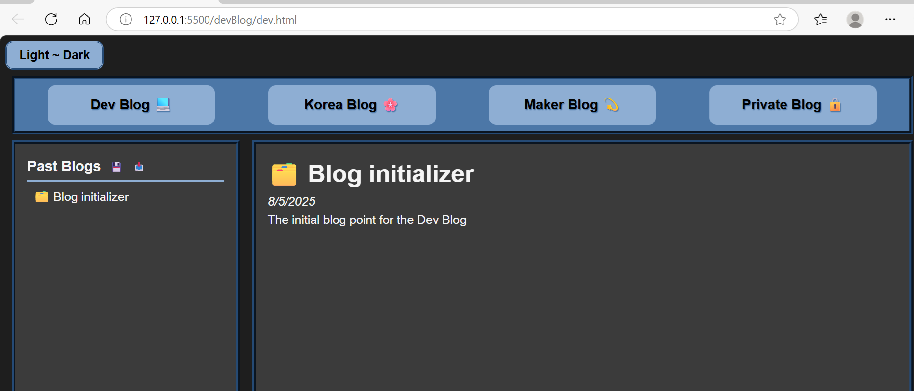

## Christina Builds Blog
---
## Objective / Purpose

A personal multi-blog project to document my journey through coding, crafting, and travel.  
The site includes four separate blogs:

1. **Dev Blog** – Coding challenges, wins, and learning notes
2. **Maker Blog** – Crafts, art, and creative projects
3. **Korea Blog** – Travel logs and experiences in Korea
4. **Personal Blog** – Private reflections and thoughts

These blogs help me track my progress and share parts of my life as I continue to grow, change and flourish.

## Technologies Used

- HTML5
- CSS3
- Vanilla JavaScript
- LocalStorage & JSON
- VS Code
- Git & GitHub

## Setup / Installation

To utilize my blog setup for yourself:

- Clone the repo:
- git clone https://github.com/Dev-Christina-Codes/blog-board.git

- add blog entries in the individual JavaScript files for each blog
- open HTML in a web browser to view entries
- Blogs persist via localStorage; use the Import/Export buttons to back up entries as JSON

## Features & Functionality

- Four separate blogs navigable via a top nav bar
- Dynamic blog entry creation using Vanilla JS
- History sidebar with clickable past entries
- Local storage + JSON save and restore system
- Optional import/export for backupus
- Secret keyboard shortcut (hide edit/delete buttons)

## Results / Screenshots

## Observations & What I Learned

- File and folder organization for a multi-page project
- Dynamic HTML creation with JavaScript
- using localStorage and JSON for saving app state
- Adding small UI features like keyboard shortcuts and hidden buttons (ninja-mode!)

## Future Plans / Improvements

- Regular blog updates as my journey continues
- Possible web-hosted version with proper database storage

## Credits

- Inspired by my mom, who always kept journals—this is my digital version.

## License

- Currently no license applied.
